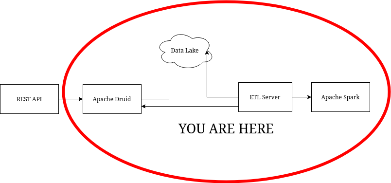

# Spark ETL Server
## Introduction
This project is part of a demo to show some of the capabilities of Spark as a ETL tool. It's part of the [demonstration using Spark and Druid](https://github.com/Ruriel-SCIO/demonstration-spark-druid). However, it's still possible to run this code separately for studying purposes.

## What is Apache Spark?
Apache Spark is a engine largely used for big data processing. It's really useful when you need to process large portions of data. You can find more information about it in the [official website](https://spark.apache.org/).

## What is Apache Druid?
It's a OLAP database designed to read big portions of data in real-time. More information about it can be seen in the [official website](https://druid.apache.org/)
## Architecture

This part of the architecture is responsible for the Extraction, Transformation and Loading of the data. Basically it will load the data from a compressed JSON file, transform it according to a metadata structure and save it in a folder, that will simulate our datalake.

## Requirements
* Docker 20.10.6
* Docker Compose 1.29.2

The setup is as simple as running a terminal command:
```console
$ docker-compose up --build 
```
Docker will create container and download all the required files, including Apache Spark and PySpark.

## Code Structure
* config
    + log4j.properties
        + log4j configuration that will be used by Spark.
    + metadata.json
        + Metadata JSON file that describes how the data should be transformed. It will be better described on the next section.
* datalake
    + generated.json.gz
        + Generated data with 10000 objects mocking various information about a customer service.
* src
    + ioOperations
        + The code responsible for reading and writing files.
    + rest
        + Responsible to send the data to Apache Druid.
    + sparkOperations
        + Anything regarding Spark is here.
    + main
        + Starts the application.

## Metadata
The metadata used in this project has the following structuring:

* **type**: Tells the type of the archive. In this example, we only use "json".
* **compression**: Indicates the compression used for the data. In this case, the data is compressed with gzip.
* **fact**: It says what the data is referencing to. This is where we define how each field will be treated.
    * **name**: Indicates the name of our fact. It will be used as a datasource name in Druid.
    * **dimensions**: Defines how each field will be read.
        * **name**: Sets the name of the field on the destination.
        * **value**: Indicates where the value is located on the JSON.
        * **type**: Indicates the type of the data. If omitted, we assume it's a string. Can also be an object.
            * **source**: Indicates the source type in case it needs conversion.
            * **destination**: Indicates the destination type.
            * **format**: If the data is a form of timestamp, such as date or timeperiod, include the format for it.
        * **isTimeDimensions**: Indicates if this field will be used as the time dimensions in Apache Druid. If none is supplied, Druid will create one when the data arrives there.
        * **format**: Date format of the time dimension.